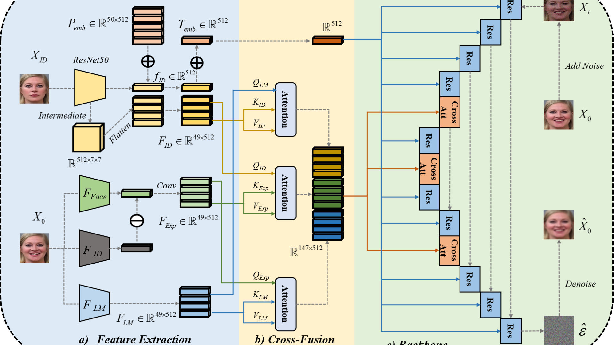

  
I'm a last-year undergraduate student from <a href="https://en.sdu.edu.cn/" style="text-decoration: none;" target="_blank">Shandong University</a>. I'm also a Research Assistant at Shandong University, under the guidance of <a href="https://yifan313.github.io/" style="text-decoration: none;" target="_blank">Prof. Yifan Xia</a>. My research interest includes machine learning, computer vision, generative models, robotics and AI4Science. I'm now working on diffusion models, in conjunction with facial paralysis images.

Education
-----
<!--

  

    
  

  

    
<strong>Shandong University</strong>

    
B.Eng. , Sep.2021 - Present

  

-->

  

    
  

  

    
Shandong University

    
Robot Engineering

    
B.Eng. , Sep.2021 - Present

  

Publications
-----
<!--
(* Equal Contribution, † Corresponding Author)
-->
<!--

  

    
  

  

    
CFCPalsy: Facial Image Synthesis with Cross-Fusion Cycle Diffusion Model for Facial Paralysis Individuals

    
<strong>Weixiang Gao</strong>, Yifan Xia

    
arXiv preprint, 2024

    

      <a href="https://arxiv.org/abs/2409.07271" style="text-decoration: none !important;" target="_blank">[Paper]</a>
      <a href="https://github.com/GaoVix/CCFExp" style="text-decoration: none !important;" target="_blank">[Code]</a>
    

  

-->

  

    
  

  

    
CFCPalsy: Facial Image Synthesis with Cross-Fusion Cycle Diffusion Model for Facial Paralysis Individuals <a href="https://arxiv.org/abs/2409.07271" style="text-decoration: none !important;" target="_blank">[Paper]</a> <a href="https://github.com/GaoVix/CCFExp" style="text-decoration: none !important;" target="_blank">[Code]</a> <strong>Weixiang Gao</strong>, Yifan Xia arXiv preprint, 2024

  

  

    
  

  

    
Artificial Intelligence-based Facial Palsy Evaluation: A Survey <a href="https://ieeexplore.ieee.org/document/10643562" style="text-decoration: none;" target="_blank">[Paper]</a> Yating Zhang, <strong>Weixiang Gao</strong>, Hui Yu, Junyu Dong, Yifan Xia IEEE Transactions on Neural Systems & Rehabilitation Engineering, 2024

  

