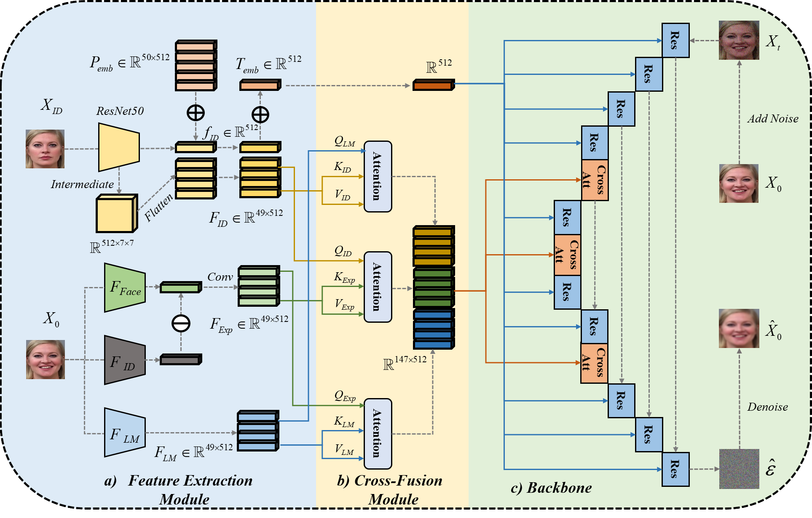

  
I'm a last-year undergraduate student from <a href="https://en.sdu.edu.cn/" style="text-decoration: none;">Shandong University</a>, under the guidance of <a href="https://yifan313.github.io/" style="text-decoration: none;">Prof. Yifan Xia</a>. My research interest includes machine learning, computer vision, generative models, embodied AI, and AI for science. I'm now working on diffusion models, in conjunction with facial paralysis images.

Education
-----

  

    
  

  

    
<strong>Shandong University</strong>

    
B.Eng. , Sep.2021 - Now

  

<!--

  

    
  

  

    
<strong>Shandong University</strong>

    
Research Assistant, Sep.2023 - Now

  

-->

Publications
-----

  

    
  

  

    
<strong>CCFExp: Facial Image Synthesis with Cycle Cross-Fusion Diffusion Model for Facial Paralysis Individuals</strong>

    
<strong>Weixiang Gao</strong>, Yifan Xia

    
arXiv preprint, 2024

    

      <a href="https://arxiv.org/abs/2409.07271" style="text-decoration: none !important;">[Paper]</a>
      <a href="https://github.com/GaoVix/CCFExp" style="text-decoration: none !important;">[Code]</a>
    

  

  

    
  

  

    
<strong>Artificial Intelligence-based Facial Palsy Evaluation: A Survey</strong>

    
Yating Zhang, <strong>Weixiang Gao</strong>, Hui Yu, Junyu Dong, Yifan Xia

    
IEEE Transactions on Neural Systems & Rehabilitation Engineering, 2024

    
<a href="https://ieeexplore.ieee.org/document/10643562" style="text-decoration: none !important;">[Paper]</a>

  

